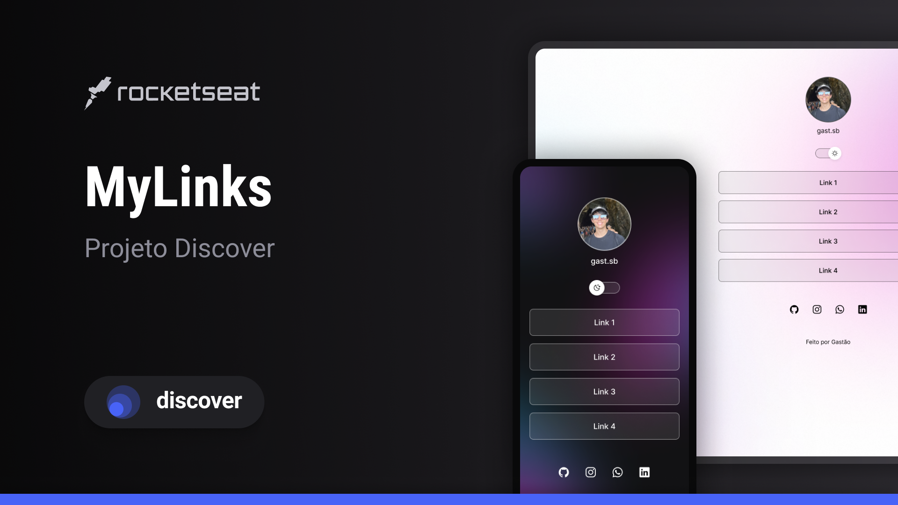

<h1 align="center"> MyLinks </h1>

  

  <a href="#-technologies">Technologies</a>&nbsp;&nbsp;&nbsp;|&nbsp;&nbsp;&nbsp;
  <a href="#-project">Project</a>&nbsp;&nbsp;&nbsp;|&nbsp;&nbsp;&nbsp;

 

  

## 🚀 Technologies

This project was developed using the following technologies:

- HTML and CSS
- JavaScript
- Git and Github

## 💻 Project

MyLinks is a repository site for projects and personal links

- [Access the finished project online](https://ghastsantos.github.io/MyLinks/)

Made by Gastão.
